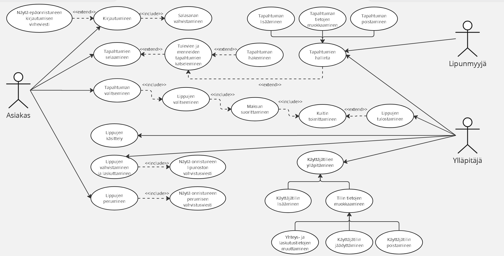

# Dokumentaatio
Järjestelmän alustava nimi: TicketGuru

## LOL G
- Antti Reinikainen
- Ramona Hirvonen
- Toni Parhiala
- Vinh Phuc Phuong
- Phong Nguyen
- Ngan Tran

## Johdanto
Projektissa toteutetaan tiketti- ja lipunmyyntijärjestelmä, joka on suunniteltu sekä loppuasiakkaille että lipunmyynnin ja järjestelmän hallinnan tarpeisiin. Järjestelmää käyttävät kolme pääkäyttäjäryhmää: asiakkaat, lipunmyyjät ja ylläpitäjät (admin), joilla kaikilla on omat roolinsa ja käyttöoikeutensa. 

Asiakas voi selata ja etsiä tulevia tapahtumia, suodattaa niitä esimerkiksi kaupungin tai hakusanan perusteella sekä ostaa ja hallita lippuja digitaalisesti. Lipunmyyjä käyttää järjestelmää asiakaspalvelutilanteissa nopeaan myyntiin, maksujen käsittelyyn sekä myyntitapahtumien seurantaan, ja kaikki toiminnot kirjataan järjestelmään. Ylläpitäjä vastaa järjestelmän turvallisuudesta ja hallinnasta, kuten käyttäjätilien ja käyttöoikeuksien ylläpidosta sekä tapahtumien näkyvyydestä. 

Järjestelmä toteutetaan web-pohjaisena sovelluksena, jossa backend on toteutettu Java Spring Boot REST APIlla ja frontend Reactilla TypeScriptiä hyödyntäen. Projektin lopputuloksena syntyy toimiva ja selkeä lipunmyyntijärjestelmä, joka tukee sujuvaa asiakaskokemusta, tehokasta lipunmyyntiä ja keskitettyä hallintaa. 

## Järjestelmän määrittely
Lipunmyyjä - Lipunmyyjä käyttää järjestelmää asiakaspalvelutilanteissa. Tehtävänä on tehdä myyntejä, käsittelee maksut ja hoitaa tarvittaessa peruutukset tai palautukset. Järjestelmän näkökulmasta lipunmyyjä on päivittäinen käyttäjä, jonka tekemät tapahtumat pitää kirjata (kuka teki, milloin teki, mitä myyntiin).

Asiakas - Asiakkaat ovat yksityishenkilöitä, jota haluavat selata tapahtumatarjontaa ja ostaa pääsylippuja. Käyttäjäryhmälle on tyypillistä satunnainen käyttö. Asiakkaalle tärkeää on luotettava palvelu, mistä saa välittömän ja selkeän vahvistuksen onnistuneesta maksusta ja lipun toimituksesta. Käyttää järjestelmää pääasiassa 	verkkoselaimella. 

Järjestelmän näkökulmasta asiakasryhmä on anonyymi (selailuvaiheessa) tai tunnistettu (kirjautumisen/oston jälkeen). Jokainen asiakkaan tekemä toiminto, kuten lipun varaus tai maksu, on voitava jäljittää yksilöllisen tilausnumeron ja asiakastiedon avulla mahdollisten reklamaatioiden vuoksi. 

Ylläpitäjä - Ylläpitäjä pitää huolen järjestelmän turvallisuudesta hallitsemalla ja valvomalla tapahtumia.  Ylläpitäjä pitää huolen myös käyttäjätilien oikeuksista ja luo tarvittaessa uusia käyttäjätilejä lipunmyyjille. Järjestelmän näkökulmasta ylläpitäjä on korkeimman tason käyttäjä.

### Käyttötapauskaavio

### Käyttäjätarinat
#### Asiakas
- Asiakkaana haluan nähdä listan tulevista tapahtumista, jotta voin löytää kiinnostavia tapahtumia. 
- Asiakkaana haluan pystyä suodattamaan listaa, esimerkiksi tapahtuman tai kaupungin mukaan, jotta pystyn helpommin löytämään tapahtumia lähellä minua. 
- Asiakkaana haluan etsiä tapahtumia hakusanalla, esimerkiksi artistin nimi. 
- Asiakkaana haluan lisätä liput ostoskoriin, jotta voin ostaa useita lippuja eri tapahtumiin samalla kertaa. 
- Asiakkaana haluan pystyä tulostamaan ostamani liput ostamisen jälkeen. 
- Asiakkaana haluan nähdä ostamani lipun, joko sivustolta tai sitten omassa sähköpostissani. 
- Asiakkaana haluan ladata ostamani lipun laitteelleni. 
- Asiakkaana haluan pystyä luomaan oman käyttäjätilin, jotta tietoni pysyvät tallennettuna. 

#### Lipunmyyjä
- Lipunmyyjänä, haluan nähdä tuotteet nopeasti, jotta jonot eivät kasva
- Kun asiakas haluaa ostaa useita lippuja, haluan muuttaa määriä, ilman uudelleenhakua.
- Kun maksu on hyväksytty, haluan kuitin yhdellä painalluksella
- Kun asiakas palaa kuitin kanssa, haluan löytää myynnin numerolla, jotta voin tarkistaa tilanteen.
- Kun vuoro loppuu, haluan yhteenvedon / raportin vuorosta esim. myyntien lukumääristä.

#### Ylläpitäjä
- Ylläpitäjänä haluan kirjautua sisään, jotta järjestelmä pysyy turvallisena 
- Ylläpitäjänä haluan luoda uusia lipunmyyjien käyttäjätilejä, jotta lipunmyynti toimii luotettavasti 
- Ylläpitäjänä haluan muokata käyttäjäoikeuksia, jotta voin varmistaa oikean pääsyn eri näkymiin 
- Ylläpitäjänä haluan poistaa tai lukita käyttäjiä, jotta voin estää väärinkäytön 
- Ylläpitäjänä haluan poistaa tai piilottaa tapahtumia, jotta voin estää väärinkäytön 
- Ylläpitäjänä haluan tarkastella kaikkia tapahtumia yhdestä näkymästä, jotta hallinta on tehokasta 

## Käyttöliitymä

### Käyttöliittymäkaavio
Linkki: https://miro.com/app/board/uXjVGRbZFy4=/?focusWidget=3458764657994404708

## Tietokanta
Teksti

### Tietohakemisto
markdown tai png kuva

### _Users_                                                                 

Kenttä | Tyyppi | Kuvaus
------ | ------ | ------ 
user_id | int PK | Käyttäjän tunniste |
email | varchar(255) NOT NULL | Sisäänkirjautumiseen käytettävä sähköposti
password_hash | varchar(255) NOT NULL | Suojattu salasana
role_id | int FK | Viittaus käyttäjän rooliin
is_active | BOOLEAN | Onko tili lukittu vai ei

### _Roles_

Kenttä | Tyyppi | Kuvaus
------ | ------ | ------
role_id | int PK | Roolin tunniste
Role_name | varchar(50) NOT NULL | Roolin nimi (admin, seller, customer)

### _Venues_

Kenttä | Tyyppi | Kuvaus
------ | ------ | ------
venue_id | int PK | Paikan tunniste
name | varchar(250) NOT NULL| Paikan nimni
city | varchar(250) NOT NULL | Kaupungin nimi
address | varchar(250) NOT NULL | Paikan osoite

### _Events_

Kenttä | Tyyppi | Kuvaus
------ | ------ | ------
event_id | int PK | Tapahtuman tunniste
title | varchar(250) NOT NULL | Tapahtuman nimi
description | varchar(250) | Kuvausteksti
start_time | datetime NOT NULL| Tapahtuman aloitusaika
venue_id | int FK | Missä tapahtuma järjestetään
status | varchar(50) DEFAULT | Tapahtuman tila (Visible, Hidden)

### _Ticket Types_

Kenttä | Tyyppi | Kuvaus
------ | ------ | ------
type_id | int PK | Lipputyypin tunniste
event_id | int FK | Mihin tapahtumaan liittyy
name | varchar(100) NOT NULL | Opiskelija, Aikuinen, Eläkeläinen
price | decimal NOT NULL | Lipun hinta

### _Tickets_

Kenttä | Tyyppi | Kuvaus
------ | ------ | ------
ticket_id | int PK | Lipun tunniste
type_id | int FK | Viittaus hintaan ja tyyppiin
order_id | int FK | Mihin tilaukseen kuuluu
qr_code | varchar(250) NOT NULL | Uniikki koodi tarkastusta varten
status | varchar(50) NOT NULL | Lipun tila (Available, Sold, Reserved)

### _Orders_

Kenttä | Tyyppi | Kuvaus
------ | ------ | ------
order_id | int PK | Tilausnumero
user_id | int FK | Kuka osti
seller_id | int FK (user_id) | Kuka myi
total_price | decimal NOT NULL | Tilauksen summa
created_at | timestamp | Myyntihetki

### _Sales Sessions_

Kenttä | Tyyppi | Kuvaus
------ | ------ | ------
session_id | int PK | Vuoron tunniste
seller_id | int FK (user_id) | Kuka oli töissä
start_time | datetime | Vuoron alkuaika
end_time | datetime | Vuoron lopetusaika

### Käsitekaavio
png

### Luokkakaavio
png

### Relaatiotietokanta
png